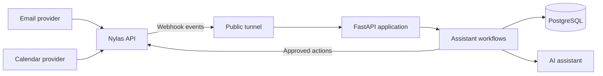

# Week 1: Project and Nylas Setup

## This Week's Goals

1. Understand the AI personal assistant and its architecture
2. Set up the local Python project
3. Create and configure a Nylas developer account
4. Connect an email account through Nylas
5. Understand how a public webhook reaches a local application
6. Become familiar with the webhook event model

Week 1 focuses on foundations. The branch includes a working local FastAPI server, Nylas authentication and webhook setup scripts, typed event models, and a simple page for inspecting received emails. Later weeks add AI workflows and persistent storage.

## Architecture



## Prerequisites

- Python 3.12 or newer
- [uv](https://docs.astral.sh/uv/)
- Git and a GitHub account
- A [Nylas developer account](https://dashboard-v3.nylas.com/register)
- An email account you can safely use for development

## 1. Clone the Project

```bash
git clone https://github.com/lindseypeng/ai-personal-assistant.git
cd ai-personal-assistant
git switch week-1
```

If cohort members maintain their own copy, they should create an empty repository and replace `origin` with its URL before pushing.

## 2. Set Up the Python Environment

```bash
uv venv
source .venv/bin/activate
uv sync
```

Start the webhook server:

```bash
uv run python -m app.main
```

Open `http://localhost:8000/health` to verify that it returns `{"status":"ok"}`.

## 3. Configure Nylas

1. Sign in to the [Nylas Dashboard](https://dashboard-v3.nylas.com/).
2. Create an application for the project.
3. Record the client ID, API key, and API region.
4. Add `http://localhost:5010/oauth/exchange` as a hosted-auth callback URL.
5. Connect a development email account and record its grant ID.

Copy the environment template:

```bash
cp .env.example .env
```

Fill in the local `.env` file:

```env
NYLAS_API_KEY=your_nylas_api_key
NYLAS_API_URI=https://api.us.nylas.com
NYLAS_CLIENT_ID=your_nylas_client_id
NYLAS_GRANT_ID=your_nylas_grant_id
NYLAS_WEBHOOK_SECRET=your_webhook_secret

EMAIL=you@example.com
SERVER_URL=https://your-public-webhook-url.example

OPENAI_API_KEY=your_openai_api_key
```

Use the EU Nylas API URI instead if the application was created in the EU region. Never commit `.env`.

Run the authentication helper:

```bash
uv run python -m app.config.config_auth
```

Visit `http://localhost:5010/nylas/auth`, connect the development account, and copy its grant ID into `.env` as `NYLAS_GRANT_ID`.

## 4. Understand the Webhook Setup

A webhook lets Nylas notify the application when an email or calendar event changes, instead of requiring the application to poll continuously.

```text
New email → Nylas → public HTTPS tunnel → local FastAPI webhook route
```

During local development, expose the FastAPI server on port `8000` with a tunneling service such as Pinggy:

```bash
ssh -p 443 -R0:localhost:8000 free.pinggy.io
```

Save the generated HTTPS URL as `SERVER_URL`, then register the webhook:

```bash
uv run python -m app.config.config_webhook
```

Copy the returned secret into `NYLAS_WEBHOOK_SECRET`. Nylas sends new-message events to `/events`; the application verifies each signature before storing or displaying the event.

## 5. Explore the Event Model

Webhook payloads are provider-facing input, not the application's permanent internal format. The intended flow is:

1. Receive and verify the Nylas event.
2. Store the raw event for traceability.
3. Normalize useful fields into the schemas under `app/schemas/`.
4. Route the event to an email or calendar service.
5. Ask for user confirmation before consequential actions.

Do not print or commit real message bodies, access tokens, or webhook secrets while experimenting.

## Project Structure

```text
app/
├── main.py                    # FastAPI app and webhook endpoint
├── config/
│   ├── config_auth.py         # Nylas hosted authentication setup
│   └── config_webhook.py      # Nylas webhook registration
├── schemas/
│   ├── nylas_email_schema.py  # Email payload model
│   └── nylas_webhook_schema.py # Webhook event model
├── services/
│   └── nylas_service.py       # Reusable email operations
└── templates/
    └── index.html             # Local webhook viewer

playground/                    # Small experiments and API exercises
requests/events/               # Ignored local webhook captures
docs/                          # Cohort guides
docker/                        # Deployment files added later
```

## Additional Resources

- [Nylas v3 documentation](https://developer.nylas.com/docs/v3/)
- [FastAPI documentation](https://fastapi.tiangolo.com/)
- [Pydantic documentation](https://docs.pydantic.dev/latest/)
- [Pinggy documentation](https://pinggy.io/)
