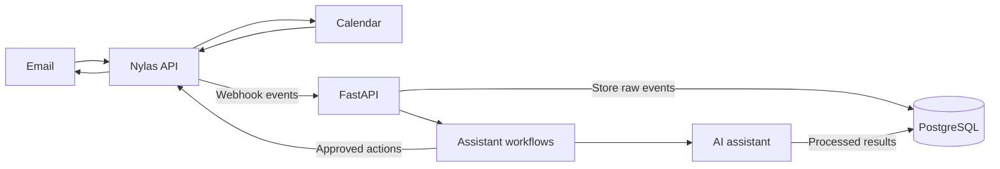

# AI Personal Assistant

## Introduction

This project builds a personal AI assistant focused on email and calendar management. It is inspired by the idea that inbox and calendar administration are among the first responsibilities busy people should delegate so they can spend more time on high-value work.

The assistant receives email and calendar events, understands what needs attention, stores useful context, and eventually helps take appropriate actions. The repository is developed incrementally as a cohort project, with each weekly branch adding another production-oriented capability.

## Why Nylas?

The project uses [Nylas](https://www.nylas.com/) as the integration layer for email and calendar providers:

- **Unified API:** one interface for Gmail, Outlook, Exchange, and other supported providers
- **Managed authentication:** hosted OAuth flows and token refresh handling
- **Webhooks:** real-time notifications when email or calendar activity occurs
- **Provider flexibility:** application workflows remain separate from provider-specific APIs

This lets the project focus on assistant behavior rather than rebuilding authentication and synchronization for every provider.

## What This Project Teaches

The assistant provides a practical setting for learning the main parts of an end-to-end AI application:

1. **External integrations:** connect securely to email and calendar services
2. **Event-driven systems:** receive and validate real-time webhook events
3. **Data modeling:** normalize provider data into stable application schemas
4. **Persistence:** store raw events, processed results, and assistant state
5. **AI workflows:** classify messages and decide which workflow should run
6. **Safe actions:** keep users in control of consequential email and calendar changes

## Architecture Overview



## Project Structure

```text
app/
├── main.py                    # FastAPI app and webhook endpoint
├── config/
│   ├── config_auth.py         # Nylas hosted authentication setup
│   └── config_webhook.py      # Nylas webhook registration
├── schemas/
│   ├── nylas_email_schema.py  # Email payload model
│   └── nylas_webhook_schema.py # Webhook event model
├── services/
│   └── nylas_service.py       # Reusable email operations
└── templates/
    └── index.html             # Local webhook viewer

playground/                    # Small experiments and API exercises
requests/events/               # Ignored local webhook captures
docs/                          # Cohort guides
docker/                        # Deployment files added later
```

## Development Approach

The repository is intentionally built in stages. `main` describes the overall destination, while each `week-*` branch captures the project at a specific point in the cohort. Start with `week-1` for environment setup, Nylas authentication, and the first webhook.

Never commit `.env`, API keys, access tokens, webhook secrets, or personal email content.
