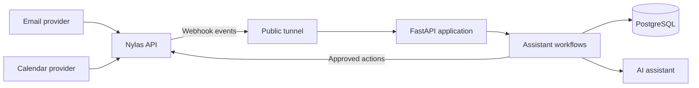

# Week 1: Project and Nylas Setup

## This Week's Goals

1. Understand the AI personal assistant and its architecture
2. Set up the local Python project
3. Create and configure a Nylas developer account
4. Connect an email account through Nylas
5. Understand how a public webhook reaches a local application
6. Become familiar with the webhook event model

Week 1 focuses on foundations. The repository contains the intended application boundaries as lightweight placeholders; later weeks will implement the workflows behind them.

## Architecture



## Prerequisites

- Python 3.12 or newer
- [uv](https://docs.astral.sh/uv/)
- Git and a GitHub account
- A [Nylas developer account](https://dashboard-v3.nylas.com/register)
- An email account you can safely use for development

## 1. Clone the Project

```bash
git clone https://github.com/lindseypeng/ai-personal-assistant.git
cd ai-personal-assistant
git switch week-1
```

If cohort members maintain their own copy, they should create an empty repository and replace `origin` with its URL before pushing.

## 2. Set Up the Python Environment

```bash
uv venv
source .venv/bin/activate
uv sync
```

Run the Week 1 starter:

```bash
uv run python -m app.main
```

Expected output:

```text
AI Personal Assistant starter project is running!
```

## 3. Configure Nylas

1. Sign in to the [Nylas Dashboard](https://dashboard-v3.nylas.com/).
2. Create an application for the project.
3. Record the client ID, API key, and API region.
4. Configure a hosted-auth callback URL for local development. The OAuth implementation will live in `app/integrations/nylas/auth.py`.
5. Connect a development email account and record its grant ID.

Copy the environment template:

```bash
cp .env.example .env
```

Fill in the local `.env` file:

```env
NYLAS_API_KEY=your_nylas_api_key
NYLAS_API_URI=https://api.us.nylas.com
NYLAS_CLIENT_ID=your_nylas_client_id
NYLAS_GRANT_ID=your_nylas_grant_id
NYLAS_WEBHOOK_SECRET=your_webhook_secret

EMAIL=you@example.com
SERVER_URL=https://your-public-webhook-url.example

OPENAI_API_KEY=your_openai_api_key
```

Use the EU Nylas API URI instead if the application was created in the EU region. Never commit `.env`.

## 4. Understand the Webhook Setup

A webhook lets Nylas notify the application when an email or calendar event changes, instead of requiring the application to poll continuously.

```text
New email → Nylas → public HTTPS tunnel → local FastAPI webhook route
```

During local development, expose the future FastAPI server on port `8000` with a tunneling service such as Pinggy:

```bash
ssh -p 443 -R0:localhost:8000 free.pinggy.io
```

Save the generated HTTPS URL as `SERVER_URL`. When webhook handling is implemented, Nylas will send events to the route in `app/api/routes/webhooks.py`, and the application must verify them with `NYLAS_WEBHOOK_SECRET` before processing them.

## 5. Explore the Event Model

Webhook payloads are provider-facing input, not the application's permanent internal format. The intended flow is:

1. Receive and verify the Nylas event.
2. Store the raw event for traceability.
3. Normalize useful fields into the schemas under `app/schemas/`.
4. Route the event to an email or calendar service.
5. Ask for user confirmation before consequential actions.

Do not print or commit real message bodies, access tokens, or webhook secrets while experimenting.

## Project Structure

```text
app/
├── main.py                    # Application entry point
├── config.py                  # Environment-based settings
├── api/routes/
│   ├── health.py              # Health endpoint
│   └── webhooks.py            # Receive Nylas webhook events
├── integrations/nylas/
│   ├── client.py              # Nylas API client
│   └── auth.py                # Hosted authentication flow
├── agents/
│   └── assistant.py           # AI decision-making logic
├── services/
│   ├── email.py               # Email workflow coordination
│   └── calendar.py            # Calendar workflow coordination
├── database/
│   ├── connection.py          # PostgreSQL connection
│   ├── models.py              # Database tables
│   └── repository.py          # Database reads and writes
└── schemas/
    ├── email.py               # Canonical email data
    ├── calendar.py            # Canonical calendar data
    └── webhook.py             # Incoming event data
```

## Additional Resources

- [Nylas v3 documentation](https://developer.nylas.com/docs/v3/)
- [FastAPI documentation](https://fastapi.tiangolo.com/)
- [Pydantic documentation](https://docs.pydantic.dev/latest/)
- [Pinggy documentation](https://pinggy.io/)
